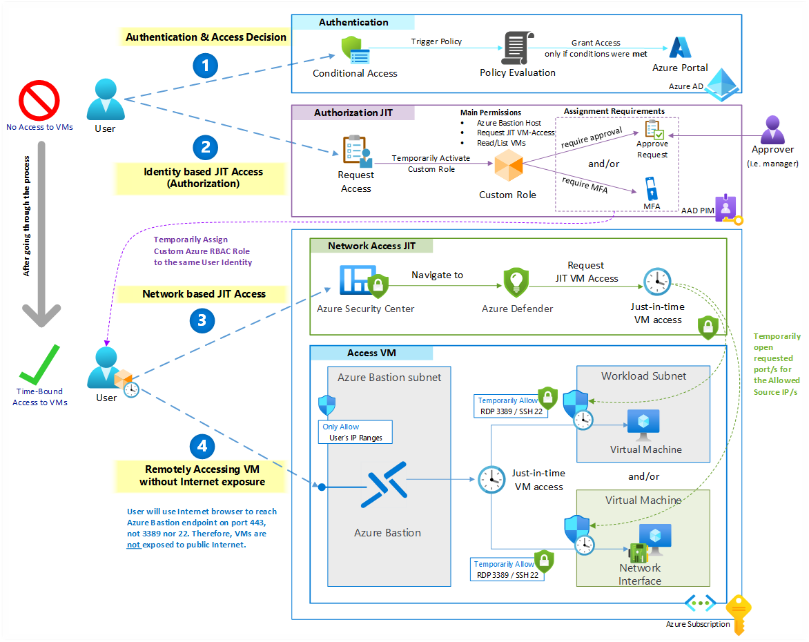

# DoubleJIT
Zero Trust Access to Azure VM through double Just in Time Access, at identity authorization level and network access level.

## Architecture

## Environment
Steps to create the initial environment

1. Create Resource Group

2. Create VNet with two subnets
   (see *note below)
   1. VMsSubnet - 10.10.0.0/24
   2. AzureBastionSubnet - 10.10.10.0/26

3. Create VM
   (see *note below)
   1. Use Image: [smalldisk] Windows Server 2022 Datacenter - Gen2
   2. Use Subnet: VMsSubnet

4. Create NSG
   (see *note below)
   1. NSG name is: VMsSubnetNSG
   2. Assign it to VMsSubnet
   3. Use this website to identify your IP https://ifconfig.me/ if you need to lock RDP port only to your IP address.

5. Create Bastion; use [this template](https://github.com/husamhilal/IaC/tree/main/ARM/AzureBastion) to deploy Azure Bastion.

6. Create sample users in Azure AD (using template provided in Assets)

7. Create sample group (HR Helpdesk) in Azure, and add Kim Smith as a member.
   
8. Setup MFA for Kim Smith account (aka.ms/SetupMFA)

> Note: Templates referenced in Step 1, 2, 3, are as is in exported state. They are meant to clarify any details during the deployment. They still need some cleaning to be in deployable state.

## Assets

> Check the "Assets" directory
1. Custom Role Definition (Virtual-Machine-JIT-User-Access.json)
2. Template for creating sample users in Azure AD (UserCreateTemplate.csv)
3. Azure ARM Exported Templates for creating VNet, VM and NSG (Exported Templates)

## Resources
- [Conditional Access in Azure Active Directory](https://docs.microsoft.com/azure/active-directory/conditional-access/overview)
- [Privileged Identity Management in Azure Active Directory](https://docs.microsoft.com/azure/active-directory/privileged-identity-management/pim-configure)
- [Azure Custom Roles in Azure RBAC](https://docs.microsoft.com/azure/role-based-access-control/custom-roles)
- [Azure Bastion](https://docs.microsoft.com/azure/bastion/bastion-overview)
- [Azure Defender just-in-time virtual machine access](https://docs.microsoft.com/azure/security-center/just-in-time-explained)
- [Microsoft Cybersecurity Reference Architectures](https://docs.microsoft.com/security/cybersecurity-reference-architecture/mcra)